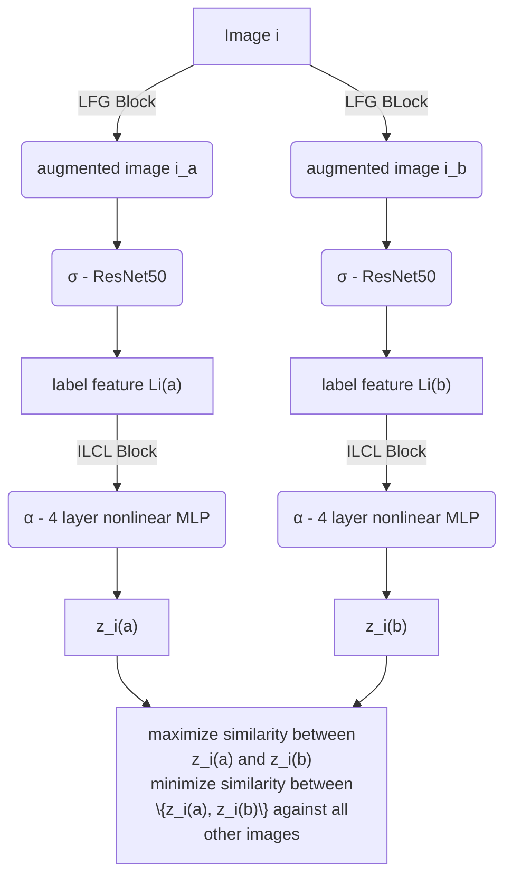
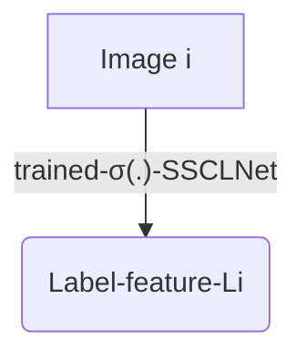

# SSCLNet-Implementation Report

Access the paper from [here](https://doi.org/10.1109/ACCESS.2023.3237542).

## Steps involved in implementation:
Following are the steps involved in the implementation of this paper:
1.  Dataset Preparation
2.  Dataset Preprocessing
3.  Training the model (available in the `implementation.ipynb` file)
4.  Results we got
5.  Comparison and conclusion

## About the Datasets
* MRI 4 Class Dataset: Available [here](https://www.kaggle.com/datasets/sartajbhuvaji/brain-tumor-classification-mri)
* MRI 2 Class Dataset: Available [here](https://www.kaggle.com/datasets/navoneel/brain-mri-images-for-brain-tumor-detection)
* MRI 4 Class Dataset with bounding boxes: Available [here](https://www.kaggle.com/datasets/ahmedsorour1/mri-for-brain-tumor-with-bounding-boxes/data)
* Glioblastoma Multiforme (GBM) 1 Class Dataset: Available [here](https://data.mendeley.com/datasets/mxsb7snyvx/1)
 
* <a href="https://drive.google.com/drive/folders/17iNx6mt5FTt3cxwrsUvVoEhyODNX0gyi" target="_blank">Dataset folder</a>
 which has all the data from raw to its preprocessed zip file.

### 1. Data Preparation
1. Deleted the `labels` folder from the `MRI 4 Class Dataset with bounding boxes` as it was not needed for our paper implementation.
2. Merged the two `4 Class Datasets` and moved the `Glioblastoma Multiforme` tumor images to the `glioma` tumor folder, since glioblastoma is a sub-class of glioma.
3. Deduplicated the complete dataset (including 2-class data and 4-class data) using MD5 Hashing. Work is shown in the `dataset-preparation.ipynb` file.

The following two steps were performed using the `dataset.py` module.

### Data Splitting Strategy
* **Pretrain**: 70% of the complete dataset was randomly sampled from both 2-class and 4-class folders, then placed in a flat directory structure without labels for self-supervised contrastive learning.
* **Train**: 20% of the complete dataset was randomly selected from the remaining 30% unseen data, maintaining the original hierarchical folder structure with proper class labels for supervised fine-tuning.
* **Test**: 10% of the complete dataset was taken from the final portion of unseen data, preserving the folder hierarchy with accurate tumor type classifications for final model evaluation.

### 2. Data Preprocessing
The complete dataset underwent the following preprocessing pipeline (as specified in the base paper):

1. **Grayscale Conversion**: All MRI images were converted to single-channel grayscale to standardize color space and reduce computational complexity.
2. **Background Removal**: Image backgrounds were eliminated using Otsu's thresholding combined with contour detection, isolating the brain region for focused analysis.
3. **Contrast Enhancement**: Histogram equalization (CLAHE) was applied to improve image contrast, followed by median filtering to reduce noise while preserving edges.
4. **Standardized Resizing**: All images were resized to 224×224 pixels to ensure consistent input dimensions for deep learning models and optimize GPU memory usage.

### 3. Implementation of the paper
Model architecture for `contrastive learning`

Model architecture for `supervised learning`
* We first get label-features against all images whose actual label we know:

* Then we use the images’ label-features (Li’s) and their labels to train a seven-layer dense neural network that uses categorical cross-entropy loss to learn accurate mappings between features and their respective classes.

### 4. Results we got
* **Contrastive Pre-training Loss**  
 
* **Class Distribution For Supervised Learning** 
 
* **Supervised Training Loss and Accuracy** 
 
* **Confusion Matrix** 
 
* **Multi-Class ROC Curve** 
 

